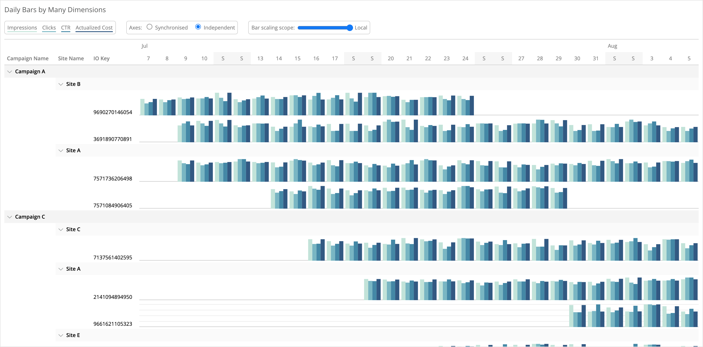

# Archived
This repo has been archived and consolidated into [mci-d3-custom-widgets](https://github.com/jdharrisnz/mci-d3-custom-widgets).

# datorama-d3-bar-pivot
Custom widget for Datorama. Visualises up to four metrics, over many dimensions, pivoted by a date.

This custom widget creates separate partitions for each dimension you add, and visualises up to four measurements in each date. Mouseover a date for exact figures, explore your data with the controls at the top, and collapse hierarchies you don't need to see.

## Set up and Dependencies
Add `barPivot.initialize();` to the JS section of the Custom Widget Editor, and add the below links to the dependencies area (second button at the top left of the Custom Widget Editor).

Script dependencies (must be loaded in this order):
1. `https://d3js.org/d3.v5.min.js`
2. `https://solutions.datorama-res.com/public_storage_solutions/barPivot/v1/barPivot.js`

Style dependency:
1. `https://solutions.datorama-res.com/public_storage_solutions/barPivot/v1/barPivot.css`

## Preferences
All preferences are located in the design tab of the widget options. These include default bar scaling choices, visualisation colours, and the date by which to pivot.